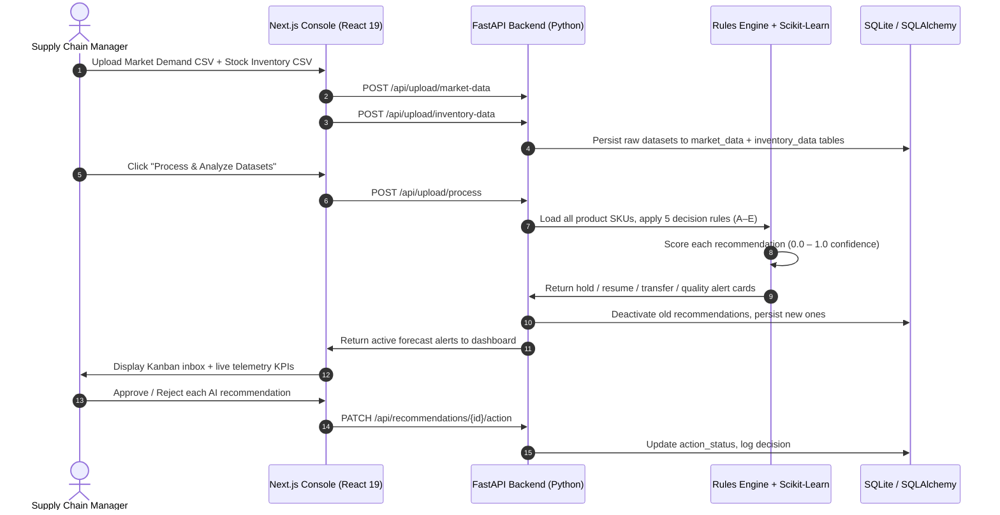

<div align="center">
  

  <p align="center">
    <samp>
      <b>Autonomous Supply Chain Forecasting &amp; Inventory Balancing Engine — Built for Indian Manufacturers</b>
    </samp>
  </p>

  <p align="center">
    
    
    
    
    
    
  </p>

  <p align="center">
    
    
    
  </p>
</div>

---

# 🚀 DemandFlow AI

**DemandFlow AI** is an enterprise-grade, AI-powered supply chain command center built specifically for **Indian manufacturers and distributors**. It ingests raw market demand and warehouse inventory data via CSV files, runs an intelligent rules engine and machine learning forecasting pipeline, and surfaces actionable recommendations directly into a Kanban-style decision inbox.

The platform goes beyond generic supply chain tools by replacing irrelevant Western metrics (CO₂ savings, fuel burn) with **real Indian business impact metrics** — working capital freed in rupees, capacity shift hours, godown storage savings, and credit default risk prevented.

> 🏭 Built for *karkhanas* (factories) that run 24×7 and need to know exactly when to **Hold Production**, **Resume Production**, **Transfer Stock**, or raise a **Quality Alert** — all in under 2 seconds of data processing.

---

## 🏆 Project Team

| S.No | Name | GitHub |
|------|------|--------|
| 1 | Challa Lokesh | — |
| 2 | Khatri Abdul Kadir | [@KadirKh](https://github.com/KadirKh) |
| 3 | Govind Sankhala | [@govindsankla90](https://github.com/govindsankla90) |
| 4 | Manikant Kumar | [@manikantbindass](https://github.com/manikantbindass) |
| 5 | Kasim Basha | — |

**Bachelor of Technology — Computer Science & Engineering**

---

## 🇮🇳 Why DemandFlow AI? — The Indian Supply Chain Problem

Indian manufacturing facilities face a unique set of challenges that generic supply chain software completely ignores:

| Problem | What Happens | Business Impact |
|---------|-------------|----------------|
| **Overproduction Lock** | Karkhanas run 24×7 even when distributors hold 80–100% unsold stock | Cash locked in raw materials & wages; godown space exhausted |
| **Stockout Cascades** | Demand spikes are not predicted early enough | Lost revenue, emergency procurement at premium cost |
| **Regional Mismatch** | City A warehouse: 95 units surplus. City B: 3 units remaining | Zero cross-warehouse visibility; stock transfers happen weeks late |
| **Credit Default Risk** | Distributors over-leveraged on dead stock | Payment defaults block next production cycle; factory halts entire SKU line |
| **Quality Blind Spot** | High factory output but very low retail pickup | Quality issues go undetected until large unsold inventory piles up |

DemandFlow AI solves all five with automated detection, real-time telemetry, and actionable directives.

---

## 📊 Live Telemetry Metrics (Indian Market Focus)

After uploading your CSV files, the Overview Dashboard immediately displays **projected 30-day savings** based on AI-detected hold signals:

| Metric | Calculation | What It Means |
|--------|------------|---------------|
| **₹ Working Capital Freed** | Hold signals × ₹15,000/day × 30 days | Cash unlocked from paused overproduction |
| **⏱ Capacity Shift Hours** | Hold signals × 8.5 hrs/day × 30 days | Machine hours freed and reallocated to fast-moving SKUs |
| **🏚 Godown Storage Savings** | Hold signals × ₹10,500/day × 30 days | Distributor godown rental/storage cost avoided |
| **🛡 Credit Default Risk Saved** | Hold signals × ₹25,000/day × 30 days | Payment default chain reaction prevented |

> All factor values are **fully adjustable** via the Tuning Settings workspace using interactive sliders.

---

## 🛠️ System Architecture & Workflow

The system is organized as a clean monorepo — a responsive Next.js dashboard paired with a high-speed Python FastAPI analytical backend.



---

## 🤖 AI Rules Engine — 5 Decision Rules

The core intelligence lives in `apps/backend/app/services/predictor.py`. For every SKU in your uploaded data, the engine applies five deterministic rules:

### Rule A — HOLD PRODUCTION 🔴
**Trigger:** Distributor warehouse has ≥ 80 units (> 80% of capacity unsold)

**Action:** Halt new manufacturing runs for this SKU.

**Business logic:** Distributor godowns are full. Pushing more inventory will only increase storage costs, block the distributor's credit line, and risk payment default. The factory should pause and let existing stock clear.

```
Score: 0.95 (high confidence)
Type:  balanced_stock
```

---

### Rule B — RESUME PRODUCTION 🟢
**Trigger:** Distributor warehouse has ≤ 30 units (< 30% remaining — 70%+ sold)

**Action:** Restart assembly lines and push fresh inventory into the channel.

**Business logic:** Stock is draining fast. If the manufacturer doesn't act now, distributors will run out before the next replenishment cycle, causing retail stockouts and competitor gains.

```
Score: dynamic (0.7 – 1.0 based on how low stock is)
Type:  production_deficit
```

---

### Rule C — NET POSITION BALANCE ⚖️
**Trigger:** Fallback when no dedicated distributor warehouse is detected. Compares total local demand (retail sales + pending shopkeeper orders) against total on-hand inventory.

**Action:** If demand > inventory → Resume Production (15% ramp-up). If demand ≤ inventory → Hold Production.

```
Score: proportional to demand/supply gap
Type:  production_deficit | balanced_stock
```

---

### Rule D — REGIONAL MISMATCH 🗺️
**Trigger:** Same SKU exists in multiple warehouses. One warehouse has ≤ 5 units while another has ≥ 30 units.

**Action:** Transfer recommendation from the surplus warehouse to the deficit location.

**Business logic:** No new production needed — inventory already exists but is in the wrong city. A simple inter-warehouse transfer resolves the stockout at minimal cost.

```
Score: 0.85
Type:  regional_mismatch
Status: pending_review (requires structural logistics approval)
```

---

### Rule E — QUALITY ALERT ⚠️
**Trigger:** Factory production metrics > 50 units, but retail sales < 10% of production.

**Action:** Flag the SKU for quality control review.

**Business logic:** When a factory produces 80 units but only 6 are sold at retail, the gap is too large to explain by seasonal demand alone. The system flags potential quality issues, packaging problems, or poor market fit for human investigation.

```
Score: 0.90
Type:  regional_mismatch (amber/warning style)
Status: pending_review
```

---

## 📈 Machine Learning Forecaster

The `forecaster.py` service trains a **Scikit-Learn LinearRegression** model per SKU per warehouse on historical order data. When < 30 days of history are available, it falls back to a **moving average** model with synthetic variance.

### Feature Engineering Pipeline

| Feature | Description |
|---------|-------------|
| `lag_1`, `lag_7`, `lag_14` | Yesterday's, last week's, 2 weeks ago demand |
| `rolling_mean_7` | 7-day smoothed demand trend |
| `rolling_mean_14` | 14-day smoothed demand trend |
| `day_of_week` | Captures weekly retail patterns (weekends spike) |
| `month` | Captures seasonal monthly patterns |
| `promo_flag` | 1 on Fri/Sat (weekend promotions), 0 otherwise |
| `temp_feature` | Annual sinusoidal signal (summer vs. winter demand shift) |

### Safety Stock & Reorder Point Formulas

$$\text{Safety Stock} = Z \times \sqrt{(LT \times \sigma_d^2) + (\mu_d^2 \times \sigma_{LT}^2)}$$

$$\text{Reorder Point (ROP)} = (\mu_d \times LT) + \text{Safety Stock}$$

**Where:**
- $Z$ = 1.65 (95% service level — standard Indian FMCG threshold)
- $\mu_d$ = Average daily demand
- $\sigma_d$ = Standard deviation of daily demand
- $LT$ = Supplier lead time in days
- $\sigma_{LT}$ = 1.5 days (standard deviation of lead time)

---

## 🖥️ Dashboard — 5 Workspaces

### Tab 1 — Overview Dashboard
The command center. Loads immediately on login with:
- **4 Live Telemetry KPIs** — Working Capital Freed (₹), Capacity Shift Hours, Godown Storage Savings (₹), Credit Default Risk Saved (₹) — all calculated from real uploaded data
- **Live Inventory Discrepancy Map** — dynamic progress bars per SKU showing distributor capacity levels, color-coded by recommendation type (red = hold, green = resume, amber = review)
- **Demand Surge Simulator** — interactive slider (−50% to +50%) to stress-test how a sudden market shift would impact your SKU inventory positions
- **Unchecked AI Decisions Counter** — quick-link to Predictions Board

### Tab 2 — Predictions Inbox (Kanban)
Three-column Kanban board:
- **📥 Action Required** — Pending hold/resume/transfer recommendations with AI confidence scores
- **🔍 Under Review** — Regional mismatch and quality alerts requiring structural approval
- **✅ Resolved** — Approved and rejected decisions with audit trail

Each card shows: SKU ID, recommendation type, full AI explanation, confidence score, and Approve/Reject buttons.

### Tab 3 — Research Lab
Deep-dive 30-day chart workspace for three representative SKUs:
- Interactive **Recharts ComposedChart** showing Distributor Stock, Customer Orders, and Holding Safety Buffer lines
- **Demand Surge Slider** — simulate ±50% demand shocks on the chart in real time
- **Concept Glossary** — four tabs explaining Safety Stock, Reorder Point (ROP), Production Throttle, and Spatial Mismatch in plain language for any team member to understand

### Tab 4 — Ingest Studio
CSV upload zone with full drag-and-drop support:

**Market Demand CSV** — required columns:
```
product_id, factory_production_metrics, local_retail_sales, pending_shopkeeper_orders
```

**Stock Inventory CSV** — required columns:
```
product_id, warehouse_location, current_inventory_counts
```

After both files are uploaded, clicking **"Process & Analyze"** triggers the full ML pipeline and redirects to the Overview Dashboard with live results.

### Tab 5 — Tuning Settings
Five interactive sliders to calibrate the telemetry to your actual business economics:

| Slider | Default | Range | Effect |
|--------|---------|-------|--------|
| Working Capital Factor | ₹15,000/day | ₹1,000 – ₹50,000 | Cash freed per paused SKU per day |
| Assembly Shift Hours | 8.5 hrs/day | 1 – 24 hrs | Machine hours reallocated per hold |
| Godown Storage Factor | ₹10,500/day | ₹500 – ₹30,000 | Storage rent saved per paused SKU |
| Credit Risk Factor | ₹25,000/day | ₹1,000 – ₹1,00,000 | Payment default risk avoided per day |
| Safety Buffer Target | 25 units | 5 – 100 units | Minimum stock floor across all SKUs |

---

## 🗂️ Demo Datasheets — 5 Industry Scenarios

Ready-to-upload datasets in `demo_datasheets/` covering five distinct Indian industries, each producing **different AI prediction outcomes**:

| Folder | Industry | Location Context | Expected AI Output |
|--------|----------|-----------------|-------------------|
| `footwear_karkhana/` | Shoes & Chappals | Agra → Delhi/Jaipur distributors | 🔴 HOLD PRODUCTION (distributor overloaded) |
| `electronics_components/` | PCBs, Chargers, Routers | Pune → Mumbai surplus, Hyderabad critical | 🔀 TRANSFER STOCK (regional mismatch) |
| `fmcg_beverages/` | Cold drinks, Juices | Noida/Delhi/Lucknow cold chain | 🟢 RESUME PRODUCTION (seasonal summer demand) |
| `textile_fabrics/` | Cotton, Silk, Denim | Surat → Ahmedabad/Mumbai godowns | ⚠️ QUALITY ALERT (high production, low retail) |
| `agri_equipment/` | Pumps, Tractors, Sprayers | Ludhiana → Punjab rural depots | ⚖️ BALANCED + RESUME mix (slow-moving rural) |

Each folder contains:
- `sales_demand.csv` — market demand & factory production data
- `stock_inventory.csv` — warehouse-level inventory counts

---

## 🗂️ Project Directory Structure

```
DemandFlow-Ai/
├── apps/
│   ├── backend/                      # FastAPI (Python) Application
│   │   ├── app/
│   │   │   ├── models.py             # SQLAlchemy ORM models
│   │   │   │                         # (User, Product, Inventory, Order,
│   │   │   │                         #  Forecast, Supplier, Recommendation,
│   │   │   │                         #  MarketData, InventoryData)
│   │   │   ├── database.py           # SQLite connection & session factory
│   │   │   ├── security.py           # JWT token creation & verification
│   │   │   ├── main.py               # FastAPI app entry point + CORS
│   │   │   ├── routers/
│   │   │   │   ├── auth.py           # Google OAuth2 + email/password auth
│   │   │   │   ├── upload.py         # CSV ingest, validate, process endpoints
│   │   │   │   ├── recommendations.py# GET/PATCH recommendation endpoints
│   │   │   │   ├── dashboard.py      # Aggregated dashboard KPI endpoint
│   │   │   │   └── products.py       # Product & inventory CRUD
│   │   │   ├── services/
│   │   │   │   ├── predictor.py      # 5-rule AI decision engine
│   │   │   │   ├── forecaster.py     # LinearRegression time-series model
│   │   │   │   └── inventory_logic.py# Safety Stock & ROP calculations
│   │   │   └── utils/
│   │   │       └── seed_data.py      # Initial product/warehouse seed script
│   │   └── requirements.txt
│   └── web/                          # Next.js (TypeScript) Web Console
│       ├── app/
│       │   ├── layout.tsx            # Root layout with Google font + theme
│       │   ├── globals.css           # Material Design 3 token system
│       │   ├── page.tsx              # Login / landing page
│       │   └── dashboard/
│       │       └── page.tsx          # Main dashboard (5 tabs, all logic)
│       ├── components/
│       │   └── ui/                   # Button, Card, Input, GlowOverlay
│       └── lib/
│           └── api-client.ts         # Axios-based backend connector + auth
├── demo_datasheets/
│   ├── sales_demand_1000.csv         # 1000-row general demo dataset
│   ├── stock_inventory_1000.csv      # 1000-row general inventory demo
│   ├── footwear_karkhana/            # Overproduction scenario
│   ├── electronics_components/       # Regional mismatch scenario
│   ├── fmcg_beverages/               # Seasonal demand scenario
│   ├── textile_fabrics/              # Quality alert scenario
│   └── agri_equipment/               # Rural slow-moving scenario
├── docs/
│   ├── banner.svg                    # Animated header graphic
│   ├── implementation_plan.md        # Architectural design document
│   └── user_guide.md                 # Step-by-step workflow manual
├── DemandFlow_AI_Presentation.pptx   # 14-slide project presentation
├── docker-compose.yml                # Full-stack Docker deployment
├── package.json                      # Monorepo dev/build orchestrator
└── reset_db.py                       # Database reset utility
```

---

## 🔑 Getting Started Locally

### Prerequisites
- **Node.js** v18 or higher
- **Python** 3.10 or higher

### Step 1 — Clone & Install

```bash
git clone https://github.com/KadirKh/DemandFlow-AI.git
cd DemandFlow-AI
npm install
```

### Step 2 — Setup Python Backend

```bash
cd apps/backend

# Create virtual environment
python -m venv venv

# Activate (Windows)
venv\Scripts\activate

# Activate (macOS / Linux)
source venv/bin/activate

# Install dependencies
pip install -r requirements.txt
```

### Step 3 — Seed the Database

```bash
# Still inside apps/backend with venv active
python -m app.utils.seed_data
```

This populates: Products, Warehouses, Suppliers, Inventory, and Order history tables.

### Step 4 — Run Development Environment

```bash
# From project root
cd ../..
npm run dev
```

| Service | URL |
|---------|-----|
| 🖥️ Frontend Dashboard | http://localhost:3001 |
| ⚙️ Backend REST API | http://localhost:8000 |
| 📖 Swagger API Docs | http://localhost:8000/docs |

---

## 🧪 Quick Demo Workflow

1. Open http://localhost:3001 and **Sign In** (Google OAuth or email)
2. Navigate to **Ingest Studio** (Tab 4)
3. Upload any two CSVs from `demo_datasheets/footwear_karkhana/`:
   - `sales_demand.csv` → Market Demand field
   - `stock_inventory.csv` → Stock Inventory field
4. Click **"Process & Analyze Datasets"**
5. Dashboard redirects to **Overview** — see live ₹ telemetry KPIs update
6. Navigate to **Predictions Inbox** — review Hold/Resume/Transfer cards
7. Click **Approve** or **Reject** on each card
8. Try uploading a different scenario folder for completely different AI outputs

> **Tip:** Try `textile_fabrics/` for Quality Alerts, or `electronics_components/` for Transfer recommendations.

---

## 🔌 REST API Reference

| Method | Endpoint | Description |
|--------|----------|-------------|
| `POST` | `/api/auth/register` | Register new manufacturer account |
| `POST` | `/api/auth/login` | Email/password login → JWT token |
| `POST` | `/api/auth/google` | Google OAuth2 login |
| `POST` | `/api/upload/market-data` | Upload market demand CSV |
| `POST` | `/api/upload/inventory-data` | Upload stock inventory CSV |
| `POST` | `/api/upload/process` | Run AI prediction pipeline |
| `POST` | `/api/upload/clear` | Clear all uploaded data |
| `GET`  | `/api/recommendations` | Fetch all active AI recommendations |
| `POST` | `/api/recommendations/{id}/action` | Approve or reject a recommendation |
| `GET`  | `/api/dashboard/summary` | Aggregated KPI summary |

Full interactive documentation: **http://localhost:8000/docs**

---

## 🧮 Key Formulas Reference

### Safety Stock
$$\text{Safety Stock} = Z \times \sqrt{(LT \times \sigma_d^2) + (\mu_d^2 \times \sigma_{LT}^2)}$$

### Reorder Point
$$\text{ROP} = (\mu_d \times LT) + \text{Safety Stock}$$

### Working Capital Impact
$$\text{WC Freed} = \text{Hold Signals} \times \text{WC Factor} \times 30 \text{ days}$$

### Capacity Shift
$$\text{Hours Freed} = \text{Hold Signals} \times \text{Machine Hours/day} \times 30 \text{ days}$$

**Where:**
- $Z$ = 1.65 (95% service level)
- $\mu_d$ = Average daily demand (units)
- $\sigma_d$ = Standard deviation of daily demand
- $LT$ = Lead time in days
- $\sigma_{LT}$ = 1.5 (lead time standard deviation in days)

---

## 🛡️ Security

- **JWT Authentication** — All API routes require a Bearer token issued at login
- **Role-based access** — `admin`, `manufacturer`, `distributor` roles stored per user
- **Google OAuth2** — Secure popup-based social login flow
- **CSV Validation** — Strict header checking before any data reaches the ML pipeline
- **CORS Policy** — Configured to allow only local development origins in dev mode

---

## 🐳 Docker Deployment

```bash
docker-compose up --build
```

This starts both the FastAPI backend and the Next.js frontend in isolated containers.

---

## 📚 Documentation

| Document | Description |
|----------|-------------|
| [User Guide](docs/user_guide.md) | Step-by-step workflow for uploading data and reviewing predictions |
| [Technical Implementation Plan](docs/implementation_plan.md) | Architecture decisions, DB schema, and API design |
| [Project Presentation](DemandFlow_AI_Presentation.pptx) | 14-slide PowerPoint covering all features, charts, and team details |

---

## 📦 Technology Stack

| Layer | Technology | Version | Purpose |
|-------|-----------|---------|---------|
| Frontend | Next.js | 16.2 | React SSR dashboard framework |
| UI Language | TypeScript | 5.x | Type-safe component development |
| Styling | Vanilla CSS + MD3 | — | Material Design 3 token system |
| Charts | Recharts | 2.x | Interactive demand/stock visualizations |
| Icons | Lucide React | — | Premium icon library |
| Backend | FastAPI | 0.110 | Async REST API framework |
| Server | Uvicorn | — | ASGI server with hot reload |
| ORM | SQLAlchemy | 2.x | Database abstraction layer |
| Database | SQLite | 3 | Zero-config embedded database |
| ML Engine | Scikit-Learn | 1.4 | LinearRegression forecasting |
| Data Processing | Pandas + NumPy | 2.x / 1.x | Feature engineering pipeline |
| Auth | Google OAuth2 + JWT | — | Secure manufacturer authentication |
| Containerization | Docker Compose | — | Multi-service deployment |
| Dev Orchestration | concurrently (npm) | — | Run frontend + backend together |

---

<div align="center">
  <p>
    <strong>DemandFlow AI</strong> — Empowering Indian manufacturers with data-driven supply chain intelligence.<br/>
    Built with ❤️ by Team Runtime Terror
  </p>
  <p>
    <a href="https://github.com/KadirKh/DemandFlow-AI">github.com/KadirKh/DemandFlow-AI</a>
  </p>
</div>
