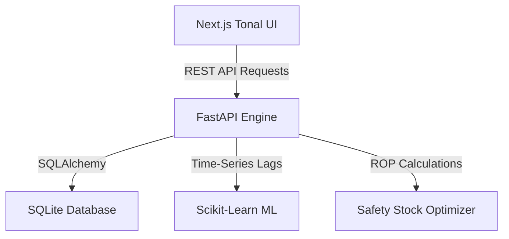
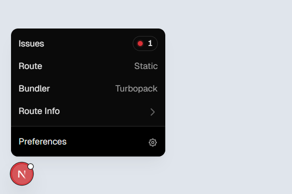
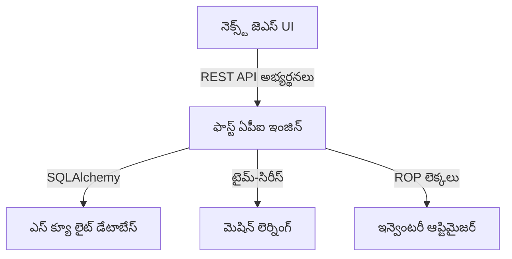
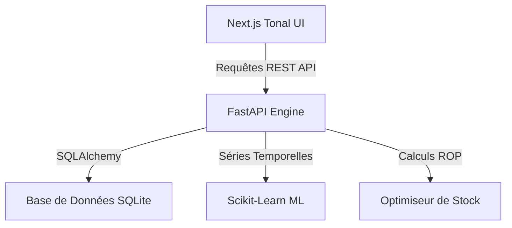

<div align="center">
  

  <p align="center">
    <samp>
      <b>Autonomous Supply Chain Forecasting & Inventory Balancing Engine</b>
    </samp>
  </p>

  <p align="center">
    <a href="#-english">🇺🇸 English</a> • 
    <a href="#-తెలుగు-telugu">🇮🇳 తెలుగు (Telugu)</a> • 
    <a href="#-français-french">🇫🇷 Français (French)</a>
  </p>

  <p align="center">
    
    
    
    
  </p>
</div>

---

# 🇺🇸 English

## 🚀 Project Overview
DemandFlow AI is an enterprise-grade demand forecasting and inventory replenishment lane optimizer. It solves real-world supply chain inefficiencies:
* **Overstocking Prevention**: Reduces costly warehousing overheads.
* **Stockout Protection**: Avoids missed retail orders.
* **Autonomous Intelligence**: Automates replenishment recommendations based on dynamic ROP (Reorder Point) formulas.

---

## 🛠️ System Architecture



---

## 🎛️ Technology Stack

| Layer | Technology | Purpose |
| :--- | :--- | :--- |
| **Frontend** | React 19, Next.js 16, Tailwind CSS v4 | Material Design 3 interface, Responsive layout, Recharts data visualization |
| **Backend** | FastAPI (Python), Uvicorn | High-performance asynchronous API, Swagger docs |
| **Database** | SQLite, SQLAlchemy | Modular schema configuration and seed utilities |
| **Analytics** | Scikit-Learn, Pandas | Time-series forecasting regression and inventory mathematics |

---

## 📚 Project Documentation
Access technical manuals and implementation resources inside the [documents/](docs/) directory:
* [User Guide & Workflow Manual](docs/user_guide.md)
* [Technical Implementation Plan](docs/implementation_plan.md)

---

## 🖥️ User Interface Preview
Below is a high-fidelity preview of the modern Material Design 3 forecasting dashboard:


---

## 🔑 Getting Started Locally

### 1. Prerequisites
- **Node.js** (v18+)
- **Python** (v3.10+)

### 2. Dependency Setup
```bash
# Clone & install root package orchestrator
git clone https://github.com/KadirKh/DemandFlow-AI.git
cd DemandFlow-AI
npm install
```

### 3. Backend & DB Seeding
```bash
cd apps/backend
python -m venv venv
venv\Scripts\activate      # Windows
source venv/bin/activate   # macOS/Linux

pip install -r requirements.txt
python -m app.utils.seed_data
```

### 4. Running Dev Environment
```bash
# From project root
npm run dev
```
- **Frontend Dashboard**: [http://localhost:3001](http://localhost:3001)
- **Backend API**: [http://localhost:8000/docs](http://localhost:8000/docs)

---

# 🇮🇳 తెలుగు (Telugu)

## 🚀 ప్రాజెక్ట్ అవలోకనం
డిమాండ్ ఫ్లో AI అనేది అధునాతన డిమాండ్ అంచనా మరియు ఇన్వెంటరీ నింపే లేన్ ఆప్టిమైజర్. ఇది రిటైల్ పరిశ్రమలో నిజ-సమయ సమస్యలను పరిష్కరిస్తుంది:
* **అధిక స్టాక్ నివారణ (Overstocking)**: నిల్వ నిర్వహణ ఖర్చులను తగ్గిస్తుంది.
* **కొరత నివారణ (Stockouts)**: ఆర్డర్‌లను కోల్పోకుండా చూస్తుంది.
* **స్వయంప్రతిపత్తి (Autonomous)**: డైనమిక్ ROP ఆధారంగా స్టాక్ నింపే సిఫార్సులను ఆటోమేట్ చేస్తుంది.

---

## 🛠️ సిస్టమ్ ఆర్కిటెక్చర్



---

## 🎛️ సాంకేతిక వివరాలు (Technology Stack)

| పొర (Layer) | సాంకేతికత (Technology) | ఉద్దేశం (Purpose) |
| :--- | :--- | :--- |
| **ఫ్రంటెండ్** | React 19, Next.js 16, Tailwind v4 | మెటీరియల్ డిజైన్ 3 ఇంటర్‌ఫేస్, రీచార్ట్స్ విజువలైజేషన్ |
| **బ్యాకెండ్** | FastAPI (Python), Uvicorn | వేగవంతమైన అసమకాలిక API సేవలు |
| **డేటాబేస్** | SQLite, SQLAlchemy | మోడ్యులర్ స్కీమా కాన్ఫిగరేషన్ మరియు సీడింగ్ |
| **విశ్లేషణ** | Scikit-Learn, Pandas | డిమాండ్ అంచనాలు మరియు ఇన్వెంటరీ గణిత శాస్త్రం |

---

## 📚 ప్రాజెక్ట్ పత్రాలు
[documents/](docs/) ఫోల్డర్‌లో అందుబాటులో ఉన్న సాంకేతిక మరియు వినియోగదారు మాన్యువల్స్:
* [వినియోగదారు గైడ్ & వర్క్‌ఫ్లో మాన్యువల్](docs/user_guide.md)
* [సాంకేతిక అమలు ప్రణాళిక](docs/implementation_plan.md)

---

## 🖥️ యూజర్ ఇంటర్‌ఫేస్ ప్రివ్యూ
ఆధునిక మెటీరియల్ డిజైన్ 3 డాష్‌బోర్డ్ ఇంటర్‌ఫేస్ యొక్క ప్రివ్యూ కింద ఇవ్వబడింది:


---

## 🔑 లోకల్ సెటప్ విధానం

### 1. అవసరమైనవి
- **Node.js** (v18+)
- **Python** (v3.10+)

### 2. డిపెండెన్సీ ఇన్‌స్టాలేషన్
```bash
git clone https://github.com/KadirKh/DemandFlow-AI.git
cd DemandFlow-AI
npm install
```

### 3. బ్యాకెండ్ & డేటాబేస్ సీడింగ్
```bash
cd apps/backend
python -m venv venv
venv\Scripts\activate      # Windows కొరకు
source venv/bin/activate   # macOS/Linux కొరకు

pip install -r requirements.txt
python -m app.utils.seed_data
```

### 4. రన్ చేయడం ఎలా
```bash
# ప్రాజెక్ట్ రూట్ ఫోల్డర్ నుండి
npm run dev
```
- **ఫ్రంటెండ్ డాష్‌బోర్డ్**: [http://localhost:3001](http://localhost:3001)
- **బ్యాకెండ్ ఏపీఐ**: [http://localhost:8000/docs](http://localhost:8000/docs)

---

# 🇫🇷 Français (French)

## 🚀 Aperçu du Projet
DemandFlow AI est un système de prévision de la demande et d'optimisation de la chaîne d'approvisionnement de classe entreprise. Il résout les inefficacités opérationnelles majeures :
* **Prévention du Surstockage**: Réduit les coûts d'entreposage excessifs.
* **Protection contre les Ruptures**: Évite les commandes manquées.
* **Décisions Autonomes**: Automatise les recommandations d'approvisionnement basées sur des équations ROP dynamiques.

---

## 🛠️ Architecture du Système



---

## 🎛️ Pile Technique

| Couche | Technologie | Rôle |
| :--- | :--- | :--- |
| **Frontend** | React 19, Next.js 16, Tailwind CSS v4 | Interface Material Design 3 épurée, Visualisation Recharts |
| **Backend** | FastAPI, Uvicorn | Routage asynchrone ultra-rapide |
| **Database** | SQLite, SQLAlchemy | Configuration modulaire des schémas et utilitaires de peuplement |
| **Analytics** | Scikit-Learn, Pandas | Prévisions de séries temporelles et mathématiques de stock |

---

## 📚 Documentation du Projet
Accédez aux manuels techniques et guides d'utilisation dans le répertoire [documents/](docs/) :
* [Guide d'Utilisation & Manuel Opérationnel](docs/user_guide.md)
* [Plan d'Implémentation Technique](docs/implementation_plan.md)

---

## 🖥️ Aperçu de l'Interface Utilisateur
Voici un aperçu haute fidélité du tableau de bord moderne et interactif développé sous Material Design 3 :


---

## 🔑 Démarrage Local

### 1. Prérequis
- **Node.js** (v18+)
- **Python** (v3.10+)

### 2. Dépendances
```bash
git clone https://github.com/KadirKh/DemandFlow-AI.git
cd DemandFlow-AI
npm install
```

### 3. Backend & Base de Données
```bash
cd apps/backend
python -m venv venv
venv\Scripts\activate      # Windows
source venv/bin/activate   # macOS/Linux

pip install -r requirements.txt
python -m app.utils.seed_data
```

### 4. Démarrage des Serveurs
```bash
# Depuis la racine du projet
npm run dev
```
- **Console Frontend**: [http://localhost:3001](http://localhost:3001)
- **API FastAPI**: [http://localhost:8000/docs](http://localhost:8000/docs)
