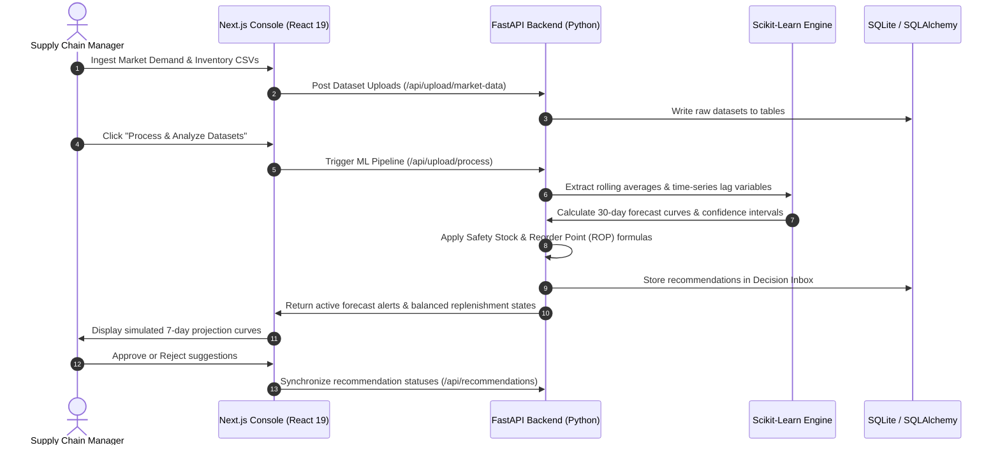

<div align="center">
  

  <p align="center">
    <samp>
      <b>Autonomous Supply Chain Forecasting & Inventory Balancing Engine</b>
    </samp>
  </p>

  <p align="center">
    
    
    
    
  </p>
</div>

---

# 🚀 DemandFlow AI

DemandFlow AI is a high-performance, enterprise-grade demand forecasting and inventory replenishment lane optimizer designed to eliminate major supply chain inefficiencies. By leveraging advanced time-series machine learning regression models and dynamic safety stock algorithms, it transforms raw sales and warehouse data into high-value automated inventory action steps.

## 📦 Key Problems Solved
* **Overstocking Prevention**: Automatically monitors storage limits and limits excess purchases to reduce costly warehousing overheads.
* **Stockout Protection**: Predicts sudden peaks in demand and generates early reorder suggestions before critical limits are breached.
* **Autonomous Replenishment**: Uses dynamic Reorder Point (ROP) math to recommend exactly when and how much inventory should be shifted.

---

## 🛠️ System Architecture & Workflow

The system is organized into a clean monorepo separating a responsive Next.js web application from a high-speed Python FastAPI analytical backend.



---

## 🎛️ Detailed Core Modules

### 1. Interactive Frontend Console (`apps/web`)
A highly optimized user dashboard styled after Material Design 3 guidelines:
* **Overview Dashboard**: High-level KPIs displaying active warnings, total registered stock, pending order limits, and system health status.
* **Forecasting Tab**: Beautiful charts rendering standard confidence bounds, active prediction intervals, and simulated 7-day forward forecasting lines.
* **Inventory Tab**: Dynamic product grid with status badges representing stock states (`Stockout`, `Low Stock`, `Overstocked`, `Optimal`).
* **Decisions Inbox**: Multi-action panel enabling supply chain managers to review, accept, or reject recommendations generated by the machine learning backend.

### 2. Analytical Backend Engine (`apps/backend`)
A high-performance asynchronous API layer powered by FastAPI and Uvicorn:
* **Database Layer**: Built on SQLite with SQLAlchemy ORM, including custom data seed scripts and schema configuration.
* **Robust CSV Parser**: Secure validation checks ensuring incoming datasets contain exact required headers before letting them proceed to training.
* **Google Authentication**: Built-in Google popup OAuth flow that registers and signs in manufacturers with authenticated profiles.

### 3. Machine Learning Predictor
The time-series forecasting pipeline uses standard Scikit-Learn linear regression models with engineered features:
* **Feature Engineering**: Calculates 7-day and 30-day rolling demand averages, lag variables, factory production metrics, promotional multipliers, and shopkeeper order trends.
* **Confidence Boundaries**: Generates 95% forecast margin boundaries to guard against high standard deviations in lead time demand.

### 4. Dynamic Replenishment Math
To ensure optimal inventory levels, the backend computes Safety Stock and Reorder Points (ROP) on every processing step:

$$\text{Safety Stock} = (Z \times \sigma_{LT}) \times \sqrt{LT}$$

$$\text{Reorder Point (ROP)} = (\text{Average Daily Demand} \times LT) + \text{Safety Stock}$$

Where:
* $Z$ is the service level multiplier (set at `1.96` for a 95% service level).
* $\sigma_{LT}$ is the standard deviation of lead time demand.
* $LT$ is the replenishment lead time in days.

---

## 🗂️ Project Directory Structure

```
DemandFlow-Ai/
├── apps/
│   ├── backend/                 # FastAPI (Python) Application
│   │   ├── app/
│   │   │   ├── models/          # SQLAlchemy Database Models
│   │   │   ├── routers/         # API Endpoint Handlers
│   │   │   ├── services/        # ML Predictor & Calculations
│   │   │   └── utils/           # Data Seed Utilities
│   │   └── main.py              # Application Entry Point
│   └── web/                     # Next.js (TypeScript) Web Console
│       ├── app/                 # Next.js App Router Pages
│       ├── components/          # Dashboard Visual Components
│       └── lib/                 # Backend API client connectors
├── docs/                        # Project Documentation
│   ├── banner.svg               # Animated Header Graphic
│   ├── implementation_plan.md   # Architectural & Database Designs
│   └── user_guide.md            # Actionable Platform Workflow Guides
└── package.json                 # Monorepo Orchestrator Script
```

---

## 🔑 Getting Started Locally

### 1. Prerequisites
- **Node.js** (v18+)
- **Python** (v3.10+)

### 2. Dependency Setup
```bash
# Clone & install root package orchestrator
git clone https://github.com/KadirKh/DemandFlow-AI.git
cd DemandFlow-AI
npm install
```

### 3. Backend & DB Seeding
```bash
cd apps/backend
python -m venv venv
venv\Scripts\activate      # Windows
source venv/bin/activate   # macOS/Linux

pip install -r requirements.txt
python -m app.utils.seed_data
```

### 4. Running Dev Environment
```bash
# From project root
npm run dev
```
* **Frontend Dashboard**: [http://localhost:3001](http://localhost:3001)
* **Backend API**: [http://localhost:8000/docs](http://localhost:8000/docs)

---

## 📚 Project Documentation
Access technical manuals and implementation resources inside the [documents/](docs/) directory:
* [User Guide & Workflow Manual](docs/user_guide.md)
* [Technical Implementation Plan](docs/implementation_plan.md)
