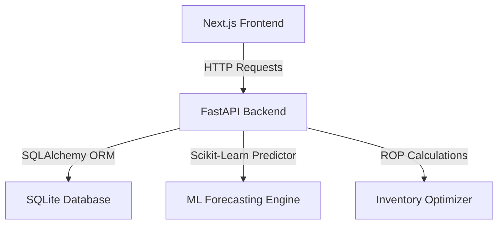

# DemandFlow AI - Technical Implementation Plan

This document outlines the detailed system design, database schemas, and algorithms used to build the DemandFlow AI platform.

## 1. System Architecture

DemandFlow AI utilizes a monorepo structure consisting of a Next.js (TypeScript) frontend console and a FastAPI (Python) machine learning backend.

---

## 2. Database Models & Schema

The core relational database is built on SQLite using SQLAlchemy:

### User Model
- `id` (Integer, Primary Key)
- `email` (String, Unique, Index)
- `hashed_password` (String)
- `role` (String, default: "manufacturer")
- `status` (String, default: "active")

### Product Model
- `id` (Integer, Primary Key)
- `sku_code` (String, Unique, Index)
- `name` (String)
- `category` (String)
- `unit_cost` (Float)

### Inventory Model
- `id` (Integer, Primary Key)
- `product_id` (Integer, ForeignKey)
- `warehouse_id` (Integer, ForeignKey)
- `on_hand` (Integer)
- `reserved` (Integer)
- `updated_at` (DateTime)

### Recommendation Model
- `id` (Integer, Primary Key)
- `user_id` (Integer, ForeignKey)
- `type` (String)
- `entity_id` (String)
- `score` (Float)
- `explanation` (String)
- `action_status` (String, default: "pending")
- `active` (Boolean, default: True)
- `created_at` (DateTime)

---

## 3. Analytics & Machine Learning Pipeline

### Demand Forecasting
The forecasting model implements a time-series predictor using Scikit-Learn:
- **Feature Engineering**: Incorporates rolling averages (7-day, 30-day), lag variables, seasonality flags, and promotional multipliers.
- **Model**: Linear Regression with 95% confidence intervals to calculate safety margins and project inventory trends over a 30-day horizon.

### Safety Stock & Reorder Point (ROP)
To prevent stockouts, safety stock margins are computed dynamically:
$$\text{Safety Stock} = (Z \times \sigma_{LT}) \times \sqrt{LT}$$
$$\text{Reorder Point (ROP)} = (\text{Average Daily Demand} \times LT) + \text{Safety Stock}$$
Where:
- $Z$ is the service level multiplier (set at 1.96 for a 95% service level).
- $\sigma_{LT}$ is the standard deviation of lead time demand.
- $LT$ is the replenishment lead time in days.
